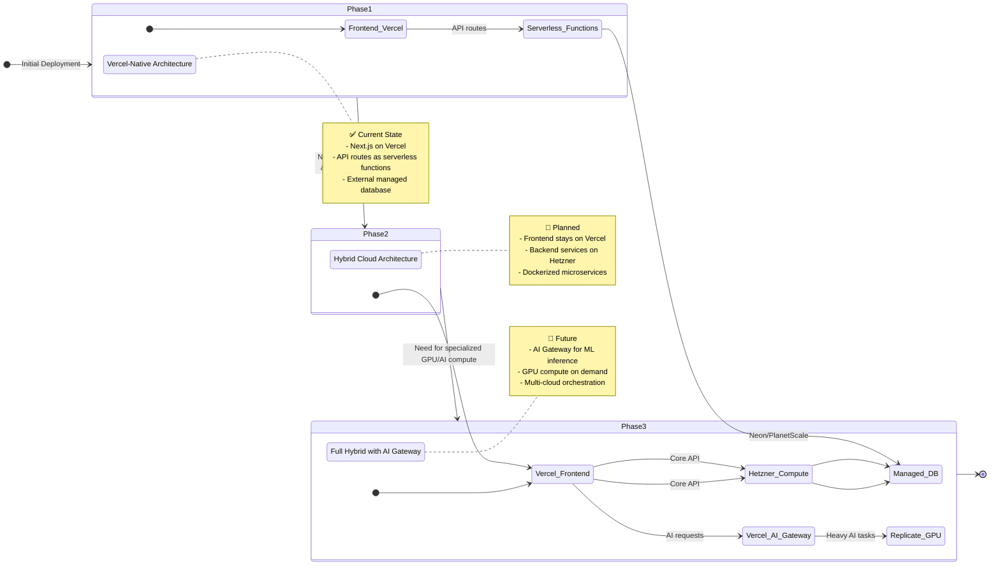
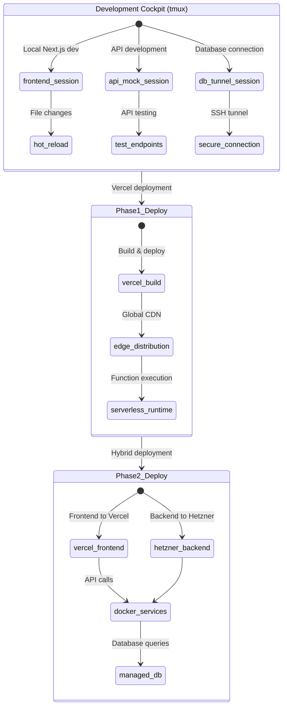

# InternetFriends Project Architecture & Evolution Plan

## Overview

This Next.js 15.2.4 project follows atomic design principles integrated with shadcn/ui components, using the InternetFriends design system with snake_case.dots naming convention.

**Vision**: We are building a robust, scalable system using a hybrid cloud model, leveraging the best services for each layer of the application. This document outlines both the current state and the planned evolution of our architecture.

## Master State Machine: From Monolith to Hybrid Cloud

Our approach is visualized as a state machine, showing the progression from our initial setup to a full-scale, high-performance system.



## Current Implementation Map

The following table shows how our existing components map to the hybrid architecture:

| Component/Directory | Current State | Phase 1 (Vercel) | Phase 2 (Hybrid) | Phase 3 (AI Gateway) |
|---------------------|---------------|-------------------|-------------------|----------------------|
| `app/(internetfriends)/` | ✅ Implemented | Vercel Edge | Vercel Edge | Vercel Edge |
| `components/organisms/header/` | ✅ Implemented | Client-side React | Client-side React | Client-side React + AI features |
| `app/api/user/profile/` | ✅ Implemented | Serverless Function | Proxy to Hetzner | Proxy to Hetzner |
| `app/api/settings/` | ✅ Implemented | Serverless Function | Proxy to Hetzner | Proxy to Hetzner |
| `app/api/ai/` | ✅ Mock | Serverless Function | Hetzner Service | AI Gateway → Replicate |
| `services/` | 📋 Planned | N/A | Docker containers | Docker containers + AI |
| `infra/` | 📋 Planned | N/A | Terraform/Pulumi | Multi-cloud IaC |

## Development Workflow Evolution



## Project Structure

```
website/
├── app/                              # Next.js App Router
│   ├── (internetfriends)/           # Route group for main site
│   │   ├── components/              # Legacy components (to be migrated)
│   │   ├── hooks/                   # Route-specific hooks
│   │   ├── lib/                     # Route-specific utilities
│   │   └── page.tsx                 # Landing page
│   ├── layout.tsx                   # Root layout
│   └── globals.css                  # Global styles
│
├── components/                       # Component Library
│   ├── ui/                          # shadcn/ui base components
│   │   ├── button.tsx               # Base button component
│   │   ├── input.tsx                # Base input component
│   │   └── ...                      # Other shadcn components
│   │
│   ├── atomic/                      # Atomic Design Level 1
│   │   ├── button/                  # Custom button variants
│   │   │   ├── button.atomic.tsx
│   │   │   ├── button.styles.module.scss
│   │   │   ├── types.ts
│   │   │   └── index.ts
│   │   ├── input/                   # Custom input variants
│   │   ├── text/                    # Typography components
│   │   └── icons/                   # Icon components
│   │
│   ├── molecular/                   # Atomic Design Level 2
│   │   ├── navigation/              # Navigation components
│   │   │   ├── navigation.molecular.tsx
│   │   │   ├── navigation.styles.module.scss
│   │   │   ├── types.ts
│   │   │   └── index.ts
│   │   ├── forms/                   # Form compositions
│   │   ├── cards/                   # Card compositions
│   │   └── search/                  # Search components
│   │
│   ├── organisms/                   # Atomic Design Level 3
│   │   ├── header/                  # Site header
│   │   │   ├── header.organism.tsx
│   │   │   ├── header.styles.module.scss
│   │   │   ├── types.ts
│   │   │   └── index.ts
│   │   ├── hero.section/            # Hero sections
│   │   ├── features.section/        # Feature sections
│   │   ├── testimonials.section/    # Testimonial sections
│   │   ├── contact.section/         # Contact sections
│   │   └── footer.section/          # Footer sections
│   │
│   └── templates/                   # Atomic Design Level 4
│       ├── landing.page/            # Landing page template
│       ├── contact.page/            # Contact page template
│       └── layout/                  # Layout templates
│
├── hooks/                           # Global Custom Hooks
│   ├── use-theme.ts                # Theme management
│   ├── use-scroll.ts               # Scroll utilities
│   ├── use-intersection.ts         # Intersection observer
│   └── index.ts                    # Hook exports
│
├── lib/                            # Utilities & Logic
│   ├── utils/                      # General utilities
│   │   ├── cn.ts                  # Class name utility (shadcn)
│   │   ├── date.ts                # Date utilities
│   │   └── validation.ts          # Form validation
│   ├── compute/                    # Business logic
│   │   ├── analytics.ts           # Analytics logic
│   │   ├── contact.ts             # Contact form logic
│   │   └── subscription.ts        # Newsletter logic
│   ├── api/                        # API utilities
│   │   ├── client.ts              # API client setup
│   │   └── types.ts               # API types
│   └── constants.ts               # App constants
│
├── styles/                         # Global Styles & Design System
│   ├── index.scss                 # Design system aggregation (tokens + mixins)
│   ├── legacy/                    # Deprecated SCSS (scheduled deletion)
│   │   ├── README.md             # Migration guide
│   │   ├── variables.scss        # DEPRECATED - Use tokens/* modules
│   │   └── mixins.scss          # DEPRECATED - Use mixins/* modules
│   ├── tokens/                    # Design Token Modules (@use syntax)
│   │   ├── colors.scss           # Brand colors, themes, glass morphism
│   │   ├── spacing.scss          # Layout, radius, breakpoints, z-index
│   │   ├── typography.scss       # Font sizes, shadows, animations
│   │   ├── fonts.scss            # Font families, semantic tokens
│   │   └── accent.scss           # Dynamic accent system
│   ├── mixins/                    # Modular Mixin Libraries (@use syntax)
│   │   ├── focus.scss            # Focus states (Mermaid-inspired dashed)
│   │   ├── media.scss            # Responsive breakpoints, feature queries
│   │   └── components.scss       # Button, card, input, glass patterns
│   └── themes/                    # Theme definitions
│       ├── light.scss            # Light theme
│       ├── dark.scss             # Dark theme
│       └── index.scss            # Theme exports
│
├── types/                          # TypeScript Definitions
│   ├── global.ts                  # Global type definitions
│   ├── components.ts              # Component prop types
│   ├── api.ts                     # API response types
│   ├── theme.ts                   # Theme types
│   └── index.ts                   # Type exports
│
├── constants/                      # Application Constants
│   ├── colors.ts                  # Color system constants
│   ├── breakpoints.ts             # Responsive breakpoints
│   ├── animations.ts              # Animation constants
│   ├── routes.ts                  # Route constants
│   └── index.ts                   # Constant exports
│
└── public/                         # Static Assets
    ├── images/                     # Image assets
    ├── icons/                      # Icon assets
    └── fonts/                      # Font files
```

## Design System Integration

### Component Hierarchy

1. **shadcn/ui Base** (`/components/ui/`)
   - Unstyled, accessible base components
   - Radix UI primitives with Tailwind styling
   - Foundation for custom variants

2. **Atomic Level** (`/components/atomic/`)
   - Extends shadcn/ui components
   - InternetFriends brand styling
   - Single responsibility principle

3. **Molecular Level** (`/components/molecular/`)
   - Combinations of atomic components
   - Form groups, navigation items, card compositions
   - Reusable UI patterns

4. **Organism Level** (`/components/organisms/`)
   - Complex UI sections
   - Header, footer, hero sections
   - Feature sections, testimonials

5. **Template Level** (`/components/templates/`)
   - Page-level layouts
   - Composition of organisms
   - Routing and data integration

### File Naming Conventions

- Components: `[name].[level].tsx` (e.g., `button.atomic.tsx`)
- Styles: `[name].styles.module.scss`
- Types: `types.ts` or `[name].types.ts`
- Index: `index.ts` (for exports)

### Import Patterns

```tsx
// shadcn/ui base components
import { Button } from "@/components/ui/button";

// Atomic components
import { ButtonAtomic } from "@/components/atomic/button";

// Molecular components
import { NavigationMolecular } from "@/components/molecular/navigation";

// Organisms
import { HeaderOrganism } from "@/components/organisms/header";

// Hooks
import { useTheme } from "@/hooks/use-theme";

// Utilities
import { cn } from "@/lib/utils/cn";
```

## Color System Architecture

### CSS Custom Properties Structure

```scss
// Base system variables
:root {
  // InternetFriends Brand Colors
  --if-primary: #3b82f6;
  --if-primary-hover: #2563eb;
  --if-primary-light: rgba(59, 130, 246, 0.08);

  // Glass morphism system
  --glass-bg-header: rgba(255, 255, 255, 0.85);
  --glass-border: rgba(255, 255, 255, 0.12);

  // Compact radius system
  --radius-xs: 0.25rem;
  --radius-sm: 0.375rem;
  --radius-md: 0.5rem;
  --radius-lg: 0.75rem;
}

// Theme-aware color system
[data-theme="light"] {
  --color-text-primary: #111827;
  --color-bg-primary: #ffffff;
  --color-border-focus: #60a5fa;
}

[data-theme="dark"] {
  --color-text-primary: #ffffff;
  --color-bg-primary: #111827;
  --color-border-focus: #60a5fa;
}
```

## Development Workflow

### Component Creation Process

1. Start with shadcn/ui base component
2. Create atomic variant with InternetFriends styling
3. Compose into molecular components as needed
4. Build organisms from molecular components
5. Create templates using organisms

### Testing Strategy

- Unit tests for atomic components
- Integration tests for molecular/organism components
- E2E tests for complete user flows
- Visual regression testing for design system consistency

### Build Process

- Next.js with Turbopack for fast development
- CSS Modules for scoped styling
- TypeScript for type safety
- Bun for package management and testing

## Integration Guidelines

### shadcn/ui Integration

- Keep base shadcn components unchanged
- Extend functionality in atomic layer
- Use composition over modification
- Maintain accessibility standards

### State Management

- React hooks for local state
- Context for theme management
- Server state via Next.js data fetching
- Form state with controlled components

### Styling Strategy

- CSS Modules for component styles
- Global SCSS for theme variables
- Tailwind utilities for rapid prototyping
- Custom properties for theme switching

### Performance Considerations

- Component lazy loading
- CSS code splitting
- Image optimization
- Bundle size monitoring

## Focus Session Roadmap

This documentation is structured to guide our deep-dive development sessions:

### 🎯 Session 1: Frontend Layer Deep-Dive
**Location**: `app/` directory
- Connect existing components to API endpoints
- Implement real data fetching patterns
- Optimize for performance and UX

### 🎯 Session 2: API Evolution Strategy  
**Location**: `app/api/` directory
- Transition from mock to real database connections
- Plan serverless → dedicated compute migration
- Design API versioning strategy

### 🎯 Session 3: Services Architecture
**Location**: `services/` directory (to be created)
- Design microservices for Hetzner deployment
- Plan Docker containerization
- Define inter-service communication patterns

### 🎯 Session 4: Infrastructure as Code
**Location**: `infra/` directory (to be created)
- Design hybrid cloud infrastructure
- Plan deployment automation
- Implement monitoring and observability

### 🎯 Session 5: AI Integration Strategy
**Location**: `app/api/ai/` and future AI components
- Design AI Gateway integration
- Plan GPU compute utilization
- Implement AI-powered features

## Epic Integration

Each development phase aligns with our epic-based workflow:

- **Epic: Foundation** → Phase 1 completion
- **Epic: Scale** → Phase 2 migration  
- **Epic: Intelligence** → Phase 3 AI integration

Use epic tools to track progress:
```bash
./scripts/epic-tools/epic start foundation --timeline="4-6 weeks" --goal="Complete Phase 1 architecture"
./scripts/epic-tools/epic dashboard
```

This architecture promotes maintainability, scalability, and consistent developer experience while providing a clear path from current implementation to enterprise-scale hybrid cloud deployment.
