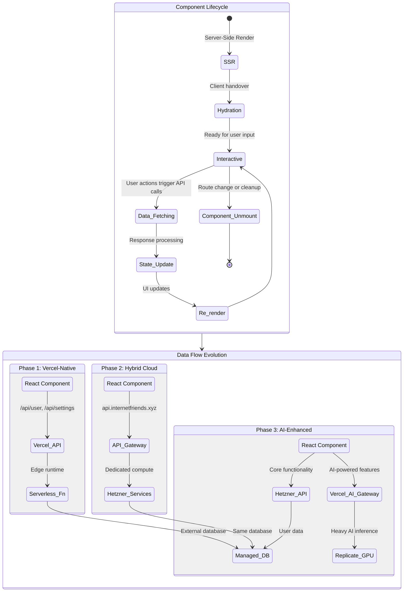
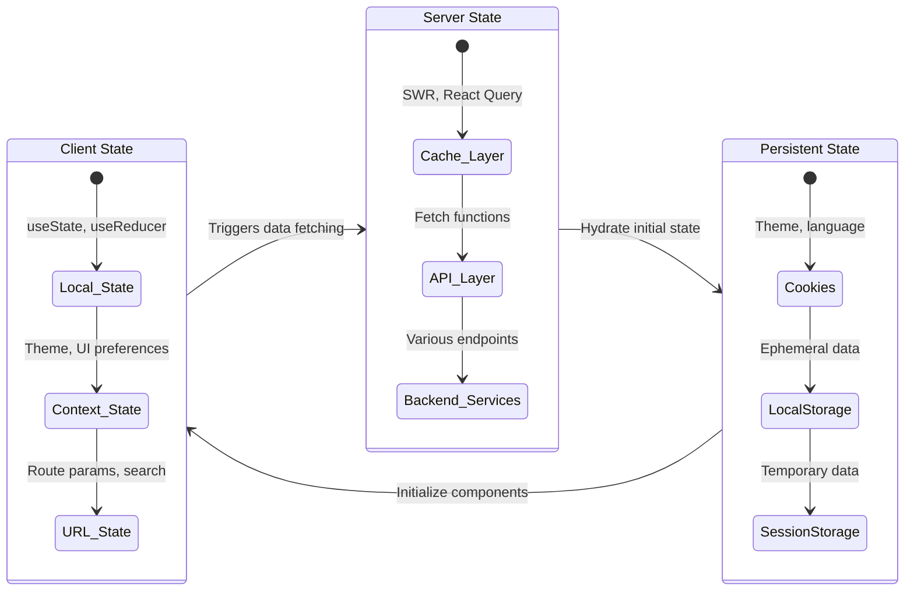

# Frontend Layer Documentation

This directory contains the entire Next.js frontend application, managed and deployed by Vercel. It represents the presentation layer of our hybrid cloud architecture.

## Core Responsibilities

- **UI/UX Rendering**: Render all user-facing components, from atomic elements to complex organisms like the `HeaderOrganism`
- **Client-Side State Management**: Handle ephemeral state (theme, UI interactions, form data)
- **Data Orchestration**: Coordinate data fetching from multiple API sources
- **Progressive Enhancement**: Provide fallbacks and optimize for performance across devices

## Frontend Architecture State Machine

This diagram shows the lifecycle of our frontend components and their interaction patterns with backend services.



## Component Integration Map

### Current Components and Their Backend Dependencies

| Component | Location | API Dependencies | Evolution Path |
|-----------|----------|------------------|----------------|
| `HeaderOrganism` | `components/organisms/header/` | `/api/user/profile`, `/api/settings` | ✅ Ready for all phases |
| `ThemeToggle` | `components/organisms/header/` | `/api/settings` | ✅ Phase 1 complete |
| `LanguageSelector` | `components/organisms/header/` | `/api/settings` | ✅ Phase 1 complete |
| `ProfileHeader` | `app/(internetfriends)/components/profile/` | `/api/user/profile` | 🔄 Needs real data connection |
| `HeroText` (WebGL) | Various hero sections | None (client-only) | 🚀 Ready for AI enhancement |
| Future `AIChat` | To be created | `/api/ai` | 🎯 Phase 3 target |
| Future `ImageProcessor` | To be created | `/api/ai` → Replicate | 🎯 Phase 3 target |

## Data Fetching Patterns

### Current Pattern (Phase 1)
```typescript
// Example: ThemeToggle component
const updateTheme = async (newTheme: Theme) => {
  // Optimistic update
  setTheme(newTheme);
  
  try {
    const response = await fetch('/api/settings', {
      method: 'POST',
      headers: { 'Content-Type': 'application/json' },
      body: JSON.stringify({ theme: newTheme })
    });
    
    if (!response.ok) {
      // Revert on failure
      setTheme(previousTheme);
    }
  } catch (error) {
    // Handle network errors
    setTheme(previousTheme);
  }
};
```

### Future Pattern (Phase 2 & 3)
```typescript
// Example: AI-enhanced component
const useAIFeature = (prompt: string) => {
  return useSWR(
    prompt ? ['ai', prompt] : null,
    async () => {
      // This will automatically route to the right backend
      // Phase 2: Hetzner service via proxy
      // Phase 3: AI Gateway → Replicate
      const response = await fetch('/api/ai', {
        method: 'POST',
        body: JSON.stringify({ prompt })
      });
      return response.json();
    },
    {
      revalidateOnFocus: false,
      dedupingInterval: 30000 // Cache AI responses
    }
  );
};
```

## Component State Management Strategy



## Performance Optimization Roadmap

### Phase 1 Optimizations (Current)
- ✅ CSS Modules for scoped styling
- ✅ Component-level code splitting
- ✅ Optimized bundle sizes with Turbopack
- ✅ Image optimization with Next.js Image component
- 🔄 Implement service worker for offline functionality

### Phase 2 Optimizations (Hybrid Cloud)
- 🎯 Edge caching for API responses
- 🎯 Streaming SSR for large data sets
- 🎯 Progressive hydration for complex components
- 🎯 WebGL performance monitoring and degradation

### Phase 3 Optimizations (AI-Enhanced)
- 🎯 AI response streaming and chunking
- 🎯 Predictive prefetching based on user behavior
- 🎯 Client-side ML models for instant feedback
- 🎯 GPU utilization monitoring and cost optimization

## Development Workflow Integration

### Local Development Setup
```bash
# Start the development cockpit
tmux new-session -d -s frontend
tmux send-keys -t frontend 'cd app && bun run dev' Enter
tmux new-window -t frontend -n 'test'
tmux send-keys -t frontend:test 'bun run test --watch' Enter
tmux new-window -t frontend -n 'build'
tmux send-keys -t frontend:build 'bun run build' Enter
```

### Component Development Lifecycle
1. **Design** → Create in Storybook/Figma
2. **Build** → Implement with TypeScript + SCSS Modules  
3. **Test** → Unit tests + Visual regression tests
4. **Integrate** → Connect to API endpoints
5. **Optimize** → Performance analysis + Bundle size check
6. **Deploy** → Vercel preview + Production deployment

## Testing Strategy

### Unit Testing (Components)
```typescript
// Example: HeaderOrganism.test.tsx
import { render, screen, fireEvent } from '@testing-library/react';
import { HeaderOrganism } from './header.organism';

describe('HeaderOrganism', () => {
  it('should update theme preference', async () => {
    render(<HeaderOrganism variant="glass" />);
    
    const themeToggle = screen.getByRole('button', { name: /theme/i });
    fireEvent.click(themeToggle);
    
    // Verify API call was made
    expect(fetch).toHaveBeenCalledWith('/api/settings', {
      method: 'POST',
      body: JSON.stringify({ theme: 'dark' })
    });
  });
});
```

### Integration Testing (Data Flow)
```typescript
// Example: Full user flow test
describe('User Settings Flow', () => {
  it('should persist theme across page reloads', async () => {
    // Test complete data round-trip
    // Component → API → Database → Component
  });
});
```

### E2E Testing (Cross-Phase Compatibility)
```typescript
// Verify component works across all architecture phases
describe('Cross-Phase Compatibility', () => {
  it('should work with serverless functions', () => {});
  it('should work with Hetzner backend', () => {});
  it('should work with AI Gateway', () => {});
});
```

## Migration Checklist

### Phase 1 → Phase 2 Migration
- [ ] Update API base URLs in environment variables
- [ ] Add retry logic for network calls
- [ ] Implement proper loading states for longer response times
- [ ] Add error boundaries for service failures
- [ ] Test WebSocket connections (if needed)

### Phase 2 → Phase 3 Migration  
- [ ] Integrate AI-powered components
- [ ] Add streaming response handlers
- [ ] Implement cost monitoring for AI API calls
- [ ] Add user consent flows for AI features
- [ ] Optimize for mobile GPU limitations

## Epic Integration

### Current Epic: Foundation
- ✅ Complete basic component architecture
- 🔄 Connect all components to Phase 1 APIs
- 🔄 Implement comprehensive error handling
- 🎯 Add performance monitoring

### Next Epic: Scale
- 🎯 Prepare components for backend migration
- 🎯 Implement advanced caching strategies
- 🎯 Add offline-first capabilities

### Future Epic: Intelligence
- 🎯 Design AI-enhanced user experiences
- 🎯 Implement real-time collaborative features
- 🎯 Add predictive UI patterns

---

**Next Action Items:**
1. Connect `ProfileHeader` to `/api/user/profile`
2. Add error boundaries to all organisms
3. Implement loading skeleton components
4. Set up performance monitoring dashboard
5. Create component interaction documentation

This frontend layer is designed to be resilient, performant, and ready to scale across our hybrid cloud architecture evolution.