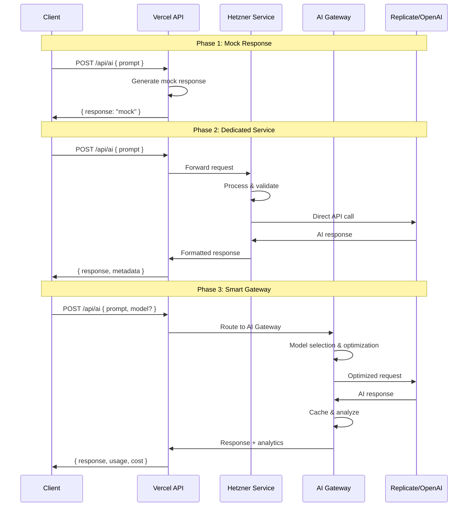
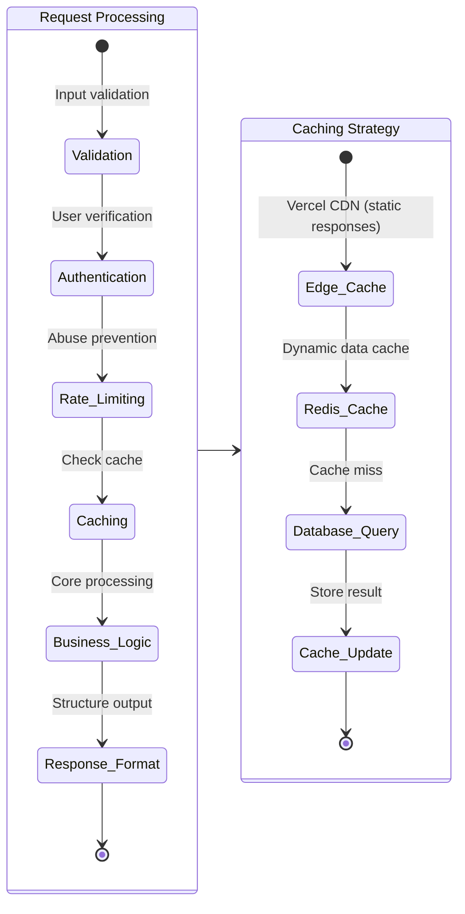

# API Layer Documentation

This directory contains the backend API for the InternetFriends application. It is designed to evolve from simple serverless functions to a robust, multi-service backend architecture.

## API Architecture Evolution

Our API layer follows a phased evolution strategy, allowing us to scale from rapid prototyping to enterprise-grade infrastructure.

```mermaid
stateDiagram-v2
    direction TB
    
    state "Phase 1: Vercel Serverless" as P1 {
        direction TB
        [*] --> Edge_Runtime: Vercel Edge Functions
        Edge_Runtime --> Serverless_Handler: route.ts files
        Serverless_Handler --> External_DB: Managed database
        
        note right of P1
            ✅ Current State
            - Auto-scaling
            - Zero maintenance
            - Global edge deployment
            - 10s execution limit
        end note
    }
    
    P1 --> P2: Need for persistent connections & background jobs
    
    state "Phase 2: Hybrid Model" as P2 {
        direction TB
        [*] --> Vercel_Proxy: API route proxies
        Vercel_Proxy --> Load_Balancer: nginx/Caddy
        Load_Balancer --> Hetzner_Services: Docker containers
        Hetzner_Services --> Database_Pool: Connection pooling
        
        note right of P2
            🚧 Planned
            - Dedicated compute power
            - WebSocket support
            - Background job processing
            - Custom middleware
        end note
    }
    
    P2 --> P3: Need for specialized AI & GPU compute
    
    state "Phase 3: AI Gateway Integration" as P3 {
        direction TB
        [*] --> Request_Router: Smart routing
        Request_Router --> Hetzner_Core: Core business logic
        Request_Router --> AI_Gateway: ML/AI requests
        AI_Gateway --> Replicate_GPU: Heavy inference
        AI_Gateway --> OpenAI_API: Text generation
        Hetzner_Core --> Database_Cluster: Scaled data layer
        
        note right of P3
            🎯 Future
            - AI request optimization
            - Multi-model inference
            - Cost-optimized routing
            - Advanced caching
        end note
    }
```

## Current API Endpoints

### User Management (`/api/user/`)

#### `GET /api/user/profile`
**Purpose**: Retrieve user profile information
**Current State**: ✅ Mock implementation
**Evolution Path**: Phase 1 → Database connection → Enhanced with AI recommendations

```typescript
// Current Response
{
  "name": "Gemini",
  "handle": "gem", 
  "avatarUrl": "/avatars/gem-avatar.png",
  "email": "gem@internetfriends.xyz",
  "plan": "Pro",
  "storageUsage": { "used": 8.5, "total": 20 }
}

// Phase 2: Enhanced Response
{
  ...currentResponse,
  "preferences": { "theme": "dark", "language": "en" },
  "activity": { "lastLogin": "2024-01-15T10:30:00Z", "sessionsThisWeek": 12 },
  "features": { "aiEnabled": true, "betaAccess": ["webgl-v2", "ai-chat"] }
}

// Phase 3: AI-Powered Response  
{
  ...phase2Response,
  "recommendations": { "suggestedFeatures": [...], "personalizedContent": [...] },
  "insights": { "usagePatterns": {...}, "optimization": {...} }
}
```

### Settings Management (`/api/settings/`)

#### `GET /api/settings` & `POST /api/settings`
**Purpose**: Manage user preferences and application settings
**Current State**: ✅ Mock implementation with in-memory storage
**Evolution Path**: Cookie-based → Database-backed → Real-time sync

```typescript
// Phase 1: Current Implementation
const updateSettings = async (newSettings) => {
  // Simple merge with mock data
  userSettings = { ...userSettings, ...newSettings };
  return userSettings;
};

// Phase 2: Database Integration
const updateSettings = async (userId, newSettings) => {
  await db.userSettings.upsert({
    where: { userId },
    update: newSettings,
    create: { userId, ...newSettings }
  });
  
  // Invalidate cache
  await redis.del(`user:${userId}:settings`);
  
  return getUserSettings(userId);
};

// Phase 3: Real-time Sync
const updateSettings = async (userId, newSettings) => {
  const updated = await db.userSettings.update(userId, newSettings);
  
  // Broadcast to all user sessions
  await websocket.broadcast(`user:${userId}`, {
    type: 'SETTINGS_UPDATED',
    payload: updated
  });
  
  // AI-powered preference learning
  await aiLearning.updateUserPreferences(userId, newSettings);
  
  return updated;
};
```

### AI Services (`/api/ai/`)

#### `POST /api/ai`
**Purpose**: Handle AI-powered interactions and inference
**Current State**: ✅ Mock implementation with response templates
**Evolution Path**: Mock → Hetzner service → AI Gateway integration



## Database Integration Strategy

### Phase 1: External Managed Database
```typescript
// Environment setup
const DATABASE_URL = process.env.DATABASE_URL; // Neon, PlanetScale, etc.
const db = new PrismaClient({ datasourceUrl: DATABASE_URL });

// Connection in serverless functions
export async function GET() {
  const users = await db.user.findMany();
  return NextResponse.json(users);
}
```

### Phase 2: Connection Pooling & Optimization
```typescript
// Hetzner service with connection pooling
import { Pool } from 'pg';

const pool = new Pool({
  connectionString: process.env.DATABASE_URL,
  max: 20, // Maximum pool size
  idleTimeoutMillis: 30000,
  connectionTimeoutMillis: 2000,
});

// Service-level database access
export class UserService {
  async findById(id: string) {
    const client = await pool.connect();
    try {
      const result = await client.query('SELECT * FROM users WHERE id = $1', [id]);
      return result.rows[0];
    } finally {
      client.release();
    }
  }
}
```

### Phase 3: Distributed Data Strategy
```typescript
// Multi-database architecture
const databases = {
  primary: new Pool({ connectionString: process.env.PRIMARY_DB_URL }),
  analytics: new Pool({ connectionString: process.env.ANALYTICS_DB_URL }),
  cache: new Redis({ url: process.env.REDIS_URL })
};

// Smart data routing
export class DataService {
  async getUserProfile(userId: string) {
    // Check cache first
    const cached = await databases.cache.get(`user:${userId}`);
    if (cached) return JSON.parse(cached);
    
    // Fetch from primary database
    const user = await databases.primary.query(
      'SELECT * FROM users WHERE id = $1', [userId]
    );
    
    // Cache for future requests
    await databases.cache.setex(`user:${userId}`, 300, JSON.stringify(user));
    
    return user;
  }
}
```

## API Performance Optimization

### Request/Response Optimization


### Error Handling & Resilience
```typescript
// Comprehensive error handling
export class APIError extends Error {
  constructor(
    message: string,
    public statusCode: number = 500,
    public code: string = 'INTERNAL_ERROR',
    public details?: any
  ) {
    super(message);
    this.name = 'APIError';
  }
}

// Error middleware
export function withErrorHandling(handler: Function) {
  return async (request: NextRequest) => {
    try {
      return await handler(request);
    } catch (error) {
      console.error('API Error:', error);
      
      if (error instanceof APIError) {
        return NextResponse.json(
          { error: error.message, code: error.code, details: error.details },
          { status: error.statusCode }
        );
      }
      
      return NextResponse.json(
        { error: 'Internal server error' },
        { status: 500 }
      );
    }
  };
}

// Usage example
export const POST = withErrorHandling(async (request: NextRequest) => {
  const body = await request.json();
  
  if (!body.email) {
    throw new APIError('Email is required', 400, 'MISSING_EMAIL');
  }
  
  // Process request...
  return NextResponse.json({ success: true });
});
```

## Testing Strategy

### Unit Testing (Individual Endpoints)
```typescript
// Example: settings.test.ts
import { POST } from './api/settings/route';
import { NextRequest } from 'next/server';

describe('/api/settings', () => {
  it('should update user theme preference', async () => {
    const request = new NextRequest('http://localhost/api/settings', {
      method: 'POST',
      body: JSON.stringify({ theme: 'dark' })
    });
    
    const response = await POST(request);
    const data = await response.json();
    
    expect(response.status).toBe(200);
    expect(data.theme).toBe('dark');
  });
  
  it('should handle invalid input gracefully', async () => {
    const request = new NextRequest('http://localhost/api/settings', {
      method: 'POST',
      body: JSON.stringify({ theme: 'invalid-theme' })
    });
    
    const response = await POST(request);
    expect(response.status).toBe(400);
  });
});
```

### Integration Testing (Cross-Service)
```typescript
// Example: user-settings.integration.test.ts
describe('User Settings Integration', () => {
  it('should sync settings across user profile and preferences', async () => {
    // Create user
    const userResponse = await fetch('/api/user/profile', { method: 'POST', ... });
    const user = await userResponse.json();
    
    // Update settings
    const settingsResponse = await fetch('/api/settings', {
      method: 'POST',
      body: JSON.stringify({ theme: 'dark' })
    });
    
    // Verify profile reflects changes
    const updatedProfile = await fetch(`/api/user/profile?id=${user.id}`);
    const profile = await updatedProfile.json();
    
    expect(profile.preferences.theme).toBe('dark');
  });
});
```

### Load Testing (Performance Validation)
```typescript
// Example: load-test.ts using Artillery or k6
export const options = {
  vus: 100, // Virtual users
  duration: '30s',
};

export default function () {
  const response = http.post('http://localhost:3000/api/settings', 
    JSON.stringify({ theme: 'dark' }),
    { headers: { 'Content-Type': 'application/json' } }
  );
  
  check(response, {
    'status is 200': (r) => r.status === 200,
    'response time < 500ms': (r) => r.timings.duration < 500,
  });
}
```

## Security Implementation

### Authentication & Authorization
```typescript
// JWT-based authentication
import jwt from 'jsonwebtoken';

export function withAuth(handler: Function) {
  return async (request: NextRequest) => {
    const token = request.headers.get('authorization')?.replace('Bearer ', '');
    
    if (!token) {
      return NextResponse.json(
        { error: 'Authentication required' },
        { status: 401 }
      );
    }
    
    try {
      const payload = jwt.verify(token, process.env.JWT_SECRET!);
      // Add user context to request
      request.user = payload;
      return await handler(request);
    } catch (error) {
      return NextResponse.json(
        { error: 'Invalid token' },
        { status: 403 }
      );
    }
  };
}
```

### Rate Limiting & Abuse Prevention
```typescript
// Redis-based rate limiting
import Redis from 'ioredis';

const redis = new Redis(process.env.REDIS_URL);

export function withRateLimit(
  maxRequests: number = 100,
  windowMs: number = 60000 // 1 minute
) {
  return (handler: Function) => {
    return async (request: NextRequest) => {
      const ip = request.headers.get('x-forwarded-for') || 'unknown';
      const key = `rate_limit:${ip}`;
      
      const current = await redis.incr(key);
      
      if (current === 1) {
        await redis.expire(key, Math.ceil(windowMs / 1000));
      }
      
      if (current > maxRequests) {
        return NextResponse.json(
          { error: 'Too many requests' },
          { status: 429 }
        );
      }
      
      return await handler(request);
    };
  };
}
```

## Migration Planning

### Phase 1 → Phase 2 Checklist
- [ ] Set up Hetzner server with Docker
- [ ] Implement API proxy layer in Vercel
- [ ] Migrate database connections to connection pooling
- [ ] Add health checks and monitoring
- [ ] Implement graceful degradation (fallback to Vercel if Hetzner is down)
- [ ] Update frontend to handle longer response times
- [ ] Add comprehensive logging and observability

### Phase 2 → Phase 3 Checklist  
- [ ] Integrate Vercel AI SDK
- [ ] Set up AI Gateway routing logic
- [ ] Implement cost monitoring and budgets
- [ ] Add AI response caching strategies
- [ ] Create AI model selection algorithms
- [ ] Implement streaming responses for large AI outputs
- [ ] Add user consent and privacy controls for AI features

## Epic Integration

### Current Epic: API Foundation
- ✅ Basic endpoint structure implemented
- 🔄 Connect to real database (Neon/PlanetScale)
- 🔄 Add comprehensive error handling
- 🎯 Implement authentication system
- 🎯 Add rate limiting and security measures

### Next Epic: Backend Migration
- 🎯 Set up Hetzner infrastructure
- 🎯 Implement service orchestration
- 🎯 Add monitoring and observability
- 🎯 Performance optimization and caching

### Future Epic: AI Integration
- 🎯 AI Gateway implementation
- 🎯 Multi-model inference setup
- 🎯 Cost optimization strategies
- 🎯 Advanced AI features development

---

**Immediate Next Actions:**
1. Connect `/api/user/profile` to real database
2. Implement proper error handling across all endpoints
3. Add input validation and sanitization
4. Set up basic authentication flow
5. Create API documentation with OpenAPI/Swagger
6. Implement health check endpoints

This API layer is designed to be resilient, scalable, and ready to evolve across our hybrid cloud architecture while maintaining backward compatibility and optimal performance.