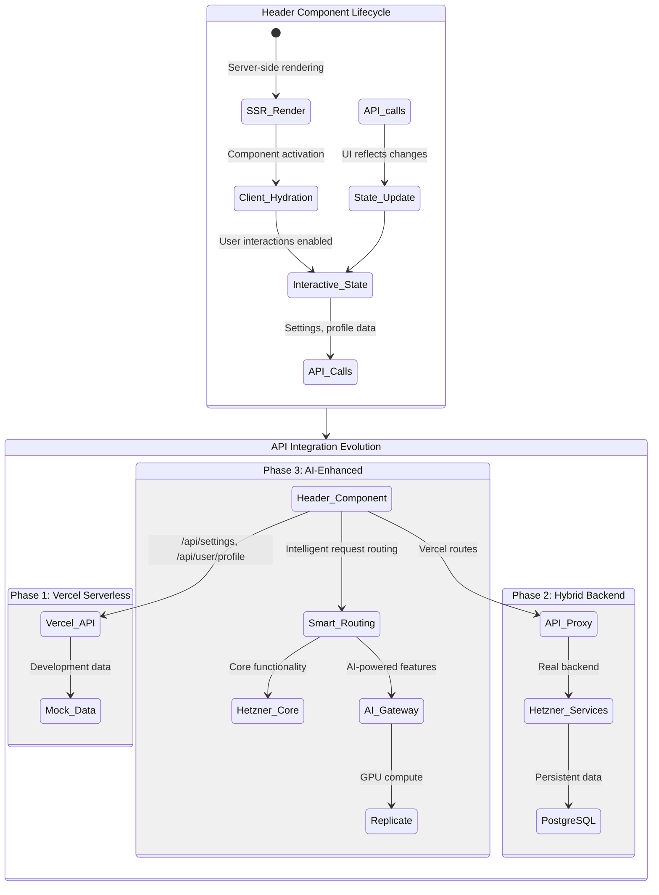

# Header Organism Documentation

The `HeaderOrganism` is a complex, feature-rich component that serves as the primary navigation and brand identity element across the InternetFriends platform. It exemplifies our atomic design principles and demonstrates seamless integration with our hybrid cloud architecture.

## Component Overview

The header combines multiple molecular and atomic components into a cohesive organism that handles:
- **Brand Identity**: Logo display and navigation
- **User Interactions**: Theme toggling, language selection, search
- **Responsive Behavior**: Mobile-friendly navigation patterns
- **Performance**: Optimized scroll interactions with WebGL effects
- **Accessibility**: Complete keyboard navigation and screen reader support

## Architecture Integration

This component perfectly demonstrates how our frontend components integrate across all phases of our hybrid cloud evolution:



## Component Features & Backend Dependencies

### Current Implementation (Phase 1)

| Feature | Component | API Dependency | Status |
|---------|-----------|----------------|---------|
| **Logo Display** | `Link` with `Image` | None (static assets) | ✅ Complete |
| **Theme Toggle** | `ThemeToggle` molecule | `POST /api/settings` | ✅ Phase 1 ready |
| **Language Selector** | `LanguageSelector` molecule | `POST /api/settings` | ✅ Phase 1 ready |
| **User Profile** | Profile integration | `GET /api/user/profile` | 🔄 Needs connection |
| **Navigation** | `NavigationMolecular` | None (static routes) | ✅ Complete |
| **Search** | `ButtonAtomic` placeholder | Future: `POST /api/search` | 🎯 Phase 2 target |
| **Orbital Motion** | `useHeaderOrbit` hook | None (client-only) | ✅ Complete |

## Data Flow Patterns

### Theme Management Flow
```typescript
// Current implementation pattern
const ThemeToggle: React.FC = () => {
  const [theme, setTheme] = useState<Theme>('system');
  
  const handleThemeChange = async (newTheme: Theme) => {
    // Optimistic UI update
    setTheme(newTheme);
    document.documentElement.setAttribute('data-theme', newTheme);
    
    try {
      // Persist to backend (evolves across phases)
      await fetch('/api/settings', {
        method: 'POST',
        headers: { 'Content-Type': 'application/json' },
        body: JSON.stringify({ theme: newTheme })
      });
    } catch (error) {
      // Revert on failure
      setTheme(previousTheme);
      document.documentElement.setAttribute('data-theme', previousTheme);
      console.error('Failed to save theme preference:', error);
    }
  };
  
  return (
    <ButtonAtomic onClick={() => handleThemeChange(nextTheme)}>
      <ThemeIcon theme={theme} />
    </ButtonAtomic>
  );
};
```

### User Profile Integration (Phase 2+)
```typescript
// Future enhanced pattern
const ProfileSection: React.FC = () => {
  const { data: profile, error, isLoading } = useSWR(
    '/api/user/profile',
    fetcher,
    {
      revalidateOnFocus: false,
      dedupingInterval: 60000 // Cache for 1 minute
    }
  );
  
  if (isLoading) return <SkeletonAvatar />;
  if (error) return <DefaultAvatar />;
  
  return (
    <div className={styles.profileSection}>
      <Image
        src={profile.avatarUrl || '/default-avatar.png'}
        alt={`${profile.name}'s avatar`}
        width={32}
        height={32}
        className={styles.avatar}
      />
      <span className={styles.handle}>@{profile.handle}</span>
    </div>
  );
};
```

## Styling Architecture

### CSS Modules Integration
The header demonstrates our complete styling system:

```scss
// header.organism.module.scss
.headerOrganism {
  // Base positioning and layout
  position: sticky;
  top: 0;
  z-index: 40;
  width: 100%;
  
  // Design system integration
  min-height: var(--header-height, 4rem);
  
  // Orbital motion support (WebGL integration)
  will-change: transform, box-shadow, background-color, border-color;
  transform: translate3d(var(--orbit-x, 0px), var(--orbit-y, 0px), 0)
    scale(var(--orbit-scale, 1));
  
  // State-driven styling (key innovation)
  &[data-scrolled="true"] {
    // Glass morphism activation
    &.glass,
    &.transparent {
      background: var(--glass-bg-header-scrolled);
      backdrop-filter: blur(12px);
      border-bottom-color: var(--glass-border-enhanced);
    }
    
    // "Coin of value" shadow system
    box-shadow:
      0 4px 14px -4px rgba(0, 0, 0, 0.1),
      0 0 0 1px var(--glass-border-outset); // Subtle brand color
  }
  
  // Variant system
  &.glass { /* Glass morphism styles */ }
  &.solid { /* Solid background styles */ }
  &.transparent { /* Transparent styles */ }
  
  // Responsive behavior
  @media (prefers-reduced-motion: reduce) {
    transform: none !important;
    transition: none !important;
  }
}
```

### Design Token Integration
```scss
// tokens/header.scss (future enhancement)
:root {
  // Header-specific tokens
  --header-height-mobile: 3.5rem;
  --header-height-desktop: 4rem;
  --header-blur-intensity: 12px;
  --header-shadow-elevation: 4px;
  
  // Orbital motion parameters
  --orbit-amplitude-x: 6px;
  --orbit-amplitude-y: 3px;
  --orbit-scale-min: 0.75;
  --orbit-scale-max: 1.0;
}
```

## Performance Optimizations

### WebGL Integration
```typescript
// useHeaderOrbit hook (existing implementation)
export const useHeaderOrbit = (config: OrbitConfig) => {
  const headerRef = useRef<HTMLElement>(null);
  const [state, setState] = useState<OrbitState>({
    scrollY: 0,
    progress: 0,
    isScrolled: false
  });
  
  useEffect(() => {
    if (!headerRef.current || config.respectReducedMotion) return;
    
    const handleScroll = throttle(() => {
      const scrollY = window.scrollY;
      const progress = Math.min(scrollY / config.range, 1);
      
      // Calculate orbital motion values
      const orbitX = Math.sin(scrollY * 0.01) * config.amplitudeX * progress;
      const orbitY = Math.cos(scrollY * 0.01) * config.amplitudeY * progress;
      const scale = config.scaleRange[0] + 
        (config.scaleRange[1] - config.scaleRange[0]) * progress;
      
      // Apply via CSS custom properties (no re-renders)
      headerRef.current?.style.setProperty('--orbit-x', `${orbitX}px`);
      headerRef.current?.style.setProperty('--orbit-y', `${orbitY}px`);
      headerRef.current?.style.setProperty('--orbit-scale', scale.toString());
      
      setState({
        scrollY,
        progress,
        isScrolled: scrollY > config.threshold
      });
    }, config.throttle);
    
    window.addEventListener('scroll', handleScroll, { passive: true });
    return () => window.removeEventListener('scroll', handleScroll);
  }, [config]);
  
  return { state, headerRef };
};
```

### Bundle Optimization
- **Code Splitting**: Dynamic imports for complex features
- **Tree Shaking**: Only used components are bundled
- **CSS Modules**: Scoped styling prevents bloat
- **Image Optimization**: Next.js automatic optimization

## Testing Strategy

### Unit Tests
```typescript
// header.organism.test.tsx
import { render, screen, fireEvent, waitFor } from '@testing-library/react';
import { HeaderOrganism } from './header.organism';
import { ThemeProvider } from '@/contexts/theme-context';

const renderHeader = (props = {}) => {
  return render(
    <ThemeProvider>
      <HeaderOrganism
        logo={{ text: "InternetFriends", href: "/" }}
        variant="glass"
        {...props}
      />
    </ThemeProvider>
  );
};

describe('HeaderOrganism', () => {
  it('should render logo and navigation', () => {
    renderHeader();
    
    expect(screen.getByText('InternetFriends')).toBeInTheDocument();
    expect(screen.getByRole('navigation')).toBeInTheDocument();
  });
  
  it('should toggle theme and persist setting', async () => {
    // Mock fetch for API call
    global.fetch = jest.fn().mockResolvedValue({
      ok: true,
      json: async () => ({ theme: 'dark' })
    });
    
    renderHeader();
    
    const themeToggle = screen.getByRole('button', { name: /theme/i });
    fireEvent.click(themeToggle);
    
    await waitFor(() => {
      expect(fetch).toHaveBeenCalledWith('/api/settings', {
        method: 'POST',
        headers: { 'Content-Type': 'application/json' },
        body: JSON.stringify({ theme: 'dark' })
      });
    });
  });
  
  it('should handle API errors gracefully', async () => {
    // Mock failed API call
    global.fetch = jest.fn().mockRejectedValue(new Error('Network error'));
    
    renderHeader();
    
    const themeToggle = screen.getByRole('button', { name: /theme/i });
    fireEvent.click(themeToggle);
    
    // Should revert theme on failure
    await waitFor(() => {
      expect(document.documentElement.getAttribute('data-theme')).toBe('light');
    });
  });
});
```

### Integration Tests
```typescript
// header.integration.test.tsx
describe('Header Integration', () => {
  it('should maintain theme consistency across page reloads', async () => {
    // Test complete user flow
    // 1. Change theme
    // 2. Reload page
    // 3. Verify theme persisted
  });
  
  it('should work across all architecture phases', async () => {
    // Test compatibility with different backend configurations
  });
});
```

## Accessibility Features

### Keyboard Navigation
- **Tab Order**: Logical navigation through interactive elements
- **Focus States**: Visible dashed borders following design system
- **Skip Links**: Jump to main content functionality
- **ARIA Labels**: Proper labeling for screen readers

### Screen Reader Support
```typescript
// Accessibility enhancements
<header
  role="banner"
  aria-label="Main navigation"
  aria-expanded={isMobileMenuOpen}
>
  <SkipToMainContent />
  
  <nav role="navigation" aria-label="Primary navigation">
    {/* Navigation items */}
  </nav>
  
  <button
    aria-label={`Switch to ${nextTheme} theme`}
    aria-pressed={theme === 'dark'}
    onClick={handleThemeToggle}
  >
    <ThemeIcon />
  </button>
</header>
```

## Future Enhancements (Phase 2 & 3)

### AI-Powered Features
```typescript
// Future: AI-enhanced search
const AISearchToggle: React.FC = () => {
  const [isAIEnabled, setIsAIEnabled] = useState(false);
  
  const handleAISearch = async (query: string) => {
    const response = await fetch('/api/ai/search', {
      method: 'POST',
      body: JSON.stringify({ 
        query, 
        context: 'navigation',
        userPreferences: await getUserPreferences()
      })
    });
    
    const { suggestions, directAnswer } = await response.json();
    
    // Display intelligent search results
    showSearchResults({ suggestions, directAnswer });
  };
  
  return (
    <SearchBox
      onSearch={isAIEnabled ? handleAISearch : handleRegularSearch}
      placeholder={isAIEnabled ? "Ask me anything..." : "Search..."}
      aiEnabled={isAIEnabled}
    />
  );
};
```

### Real-time Features
```typescript
// Future: WebSocket integration for live updates
const LiveNotifications: React.FC = () => {
  const { socket } = useWebSocket('/api/ws/notifications');
  const [notifications, setNotifications] = useState([]);
  
  useEffect(() => {
    socket?.on('notification', (notification) => {
      setNotifications(prev => [notification, ...prev.slice(0, 4)]);
      
      // Show toast notification
      showToast(notification.message, { type: notification.type });
    });
  }, [socket]);
  
  return (
    <div className={styles.notificationBadge}>
      {notifications.length > 0 && (
        <span className={styles.badge}>{notifications.length}</span>
      )}
    </div>
  );
};
```

## Epic Integration

### Current Epic: Component Foundation
- ✅ Atomic design implementation complete
- ✅ CSS Modules styling system implemented
- ✅ WebGL orbital motion integrated
- 🔄 API integration for settings persistence
- 🎯 User profile data integration

### Next Epic: Backend Integration
- 🎯 Connect to Hetzner backend services
- 🎯 Implement real-time user status
- 🎯 Add comprehensive error handling
- 🎯 Performance monitoring integration

### Future Epic: AI Enhancement
- 🎯 AI-powered search integration
- 🎯 Personalized navigation suggestions
- 🎯 Intelligent theme/language detection
- 🎯 Predictive user interface adaptations

---

## Component Usage Examples

### Basic Usage
```tsx
import { HeaderOrganism } from '@/components/organisms/header';

<HeaderOrganism
  logo={{ 
    text: "InternetFriends", 
    href: "/",
    src: "/logo.png" 
  }}
  variant="glass"
  size="md"
  navigation={{
    items: [
      { label: "Home", href: "/" },
      { label: "About", href: "/about" },
      { label: "Contact", href: "/contact" }
    ]
  }}
  themeToggle={{ show: true }}
  languageSelector={{ 
    show: true,
    languages: [
      { code: "en", name: "English" },
      { code: "es", name: "Español" }
    ]
  }}
/>
```

### Advanced Configuration
```tsx
<HeaderOrganism
  variant="transparent"
  sticky={{
    enabled: true,
    offset: 100,
    transitionDuration: "300ms"
  }}
  orbital={{
    enabled: true,
    amplitudeX: 8,
    amplitudeY: 4,
    respectReducedMotion: true
  }}
  announcement={{
    show: true,
    message: "🎉 New AI features now available!",
    type: "info",
    dismissible: true
  }}
/>
```

This header organism represents the pinnacle of our component architecture, seamlessly bridging design, functionality, and backend integration across our entire hybrid cloud evolution.