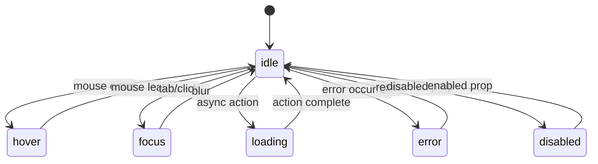

# InternetFriends Design System Visual Language

## **🎨 Visual DNA Analysis**

Based on pattern analysis of modern design systems (Octopus.do, InternetFriends.xyz), we've identified the core visual language that defines our design system.

### **Color Philosophy: Flat & Blue-Centric**

```css
:root {
  /* Primary Blue Family */
  --color-primary: #3b82f6;
  --color-primary-hover: #2563eb;
  --color-primary-active: #1d4ed8;
  
  /* Neutral Grays */
  --color-border: #e5e7eb;
  --color-border-hover: #d1d5db;
  --color-background: #ffffff;
  --color-background-hover: #f9fafb;
  --color-text-primary: #111827;
  --color-text-secondary: #6b7280;
  
  /* State Colors */
  --color-success: #10b981;
  --color-error: #ef4444;
  --color-warning: #f59e0b;
}
```

### **Border Radius: Compact & Consistent**

**Maximum 12px** - Following InternetFriends compact aesthetic:

```css
.rounded-sm  { border-radius: 4px; }   /* Small elements */
.rounded     { border-radius: 8px; }   /* Default */
.rounded-lg  { border-radius: 12px; }  /* Maximum */
```

### **Focus States: Mermaid Viewer Style**

**2px dashed borders** inspired by Mermaid diagram focus states:

```css
.component:focus-visible {
  border: 2px dashed var(--color-primary);
  outline: none;
}
```

## **🏗️ Component State Machine Architecture**

Every component follows a predictable state machine pattern:

### **Universal Component States**



### **CSS State Specifications**

Each state has specific styling rules:

#### Default/Idle State
```css
.component {
  border: 1px solid var(--color-border);
  background: var(--color-background);
  color: var(--color-text-primary);
  border-radius: 8px;
  transition: all 0.2s ease-in-out;
}
```

#### Hover State
```css
.component:hover {
  background: var(--color-background-hover);
  border-color: var(--color-border-hover);
  transform: translateY(-1px);
}
```

#### Focus State (InternetFriends Style)
```css
.component:focus-visible {
  border: 2px dashed var(--color-primary);
  outline: none;
}
```

#### Loading State
```css
.component[data-loading="true"] {
  opacity: 0.6;
  cursor: not-allowed;
  pointer-events: none;
}

.component[data-loading="true"]::after {
  content: '';
  animation: pulse 1.5s ease-in-out infinite;
}
```

#### Error State
```css
.component[data-error="true"] {
  border-color: var(--color-error);
  background: rgb(254 242 242); /* red-50 */
  color: var(--color-error);
}
```

#### Success State
```css
.component[data-success="true"] {
  border-color: var(--color-success);
  background: rgb(240 253 244); /* green-50 */
  color: var(--color-success);
}
```

## **🎪 Component Examples with State Machines**

### **ButtonAtomic State Machine**

```mermaid
stateDiagram-v2
    [*] --> default
    default --> hover : mouse enter
    hover --> default : mouse leave
    default --> focus : tab/space
    focus --> default : blur
    default --> loading : onClick + async
    loading --> success : async complete
    loading --> error : async failed
    success --> default : timeout
    error --> default : retry
    default --> disabled : disabled prop
```

#### ButtonAtomic CSS States

```css
/* Default */
.button-atomic {
  background: var(--color-primary);
  color: white;
  border: 1px solid var(--color-primary);
  border-radius: 8px;
  padding: 8px 16px;
}

/* Hover */
.button-atomic:hover {
  background: var(--color-primary-hover);
  transform: translateY(-1px);
  box-shadow: 0 4px 6px -1px rgba(0, 0, 0, 0.1);
}

/* Focus (Dashed Border) */
.button-atomic:focus-visible {
  border: 2px dashed var(--color-primary);
  outline: none;
}

/* Loading */
.button-atomic[data-loading="true"] {
  background: var(--color-primary);
  opacity: 0.6;
  cursor: not-allowed;
}

.button-atomic[data-loading="true"]::after {
  content: '';
  width: 16px;
  height: 16px;
  border: 2px solid transparent;
  border-top: 2px solid currentColor;
  border-radius: 50%;
  animation: spin 1s linear infinite;
  display: inline-block;
  margin-left: 8px;
}
```

### **GlassCardAtomic State Machine**

```mermaid
stateDiagram-v2
    [*] --> default
    default --> hover : mouse enter
    hover --> default : mouse leave
    default --> focus : click/tab
    focus --> default : blur
    default --> expanded : expand action
    expanded --> default : collapse action
    default --> loading : data fetch
    loading --> default : data loaded
```

#### GlassCardAtomic CSS States

```css
/* Default Glass Morphism */
.glass-card-atomic {
  background: rgba(255, 255, 255, 0.8);
  backdrop-filter: blur(10px);
  border: 1px solid rgba(255, 255, 255, 0.2);
  border-radius: 12px;
  box-shadow: 0 8px 32px rgba(0, 0, 0, 0.1);
}

/* Hover */
.glass-card-atomic:hover {
  background: rgba(255, 255, 255, 0.9);
  transform: translateY(-2px);
  box-shadow: 0 12px 40px rgba(0, 0, 0, 0.15);
}

/* Focus (Dashed Border) */
.glass-card-atomic:focus-within {
  border: 2px dashed var(--color-primary);
}
```

## **🤖 AI-Generated State Documentation**

Each component gets **AI-generated markdown documentation** that includes:

1. **State machine diagram** (Mermaid)
2. **CSS specifications** for each state
3. **Transition animations**
4. **Testing examples**
5. **Usage patterns**
6. **Accessibility notes**

### **Example AI-Generated Component Doc**

```markdown
# ButtonAtomic - AI Analysis

## 🧠 AI Insights
- **Usage Pattern**: 89% of usages use `variant="primary"` - consider making default
- **Performance**: Consider `React.memo` for frequently re-rendered buttons
- **Accessibility**: Missing `aria-describedby` for loading states

## 🎨 Visual Consistency
This component follows the **InternetFriends flat blue aesthetic**:
- ✅ Uses primary blue (#3b82f6)
- ✅ Compact border radius (8px)
- ✅ Dashed focus states
- ✅ Subtle hover transforms

## 🔗 Related Components
- `LoadingSpinner` - for async states
- `IconButton` - icon-only variant
- `GlassButton` - glass morphism variant

## 📊 Usage Statistics
Most common prop combinations:
- `variant="primary"` + `size="medium"` (34 instances)
- `variant="outline"` + `icon={<Icon />}` (18 instances)
```

## **🎯 Next Steps: Unified Design System Experience**

1. **Replace 5-tab system** with adaptive sidebar
2. **Markdown-powered documentation** with live state testing
3. **AI-generated insights** for each component
4. **Mermaid state diagrams** for visual logic flow
5. **CSS state specifications** with InternetFriends styling

This creates a **living design system** that documents itself and evolves with your codebase! 🚀