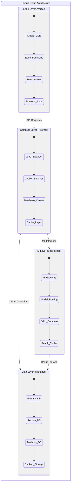

# Infrastructure Layer Documentation

This directory contains the Infrastructure as Code (IaC) definitions and deployment strategies for the InternetFriends hybrid cloud architecture. It orchestrates the complete infrastructure across Vercel, Hetzner, and specialized AI services.

## Infrastructure Architecture Overview

Our infrastructure follows a hybrid cloud model that leverages the strengths of different providers while maintaining cost efficiency and performance optimization.



## Infrastructure Evolution Timeline

### Phase 1: Vercel-Native (Current State)
**Timeline**: ✅ Completed
**Cost**: ~$20-50/month
**Capacity**: 1K-10K users

```yaml
# Current Infrastructure
Vercel:
  - Frontend hosting (Next.js)
  - Serverless API functions
  - Global CDN
  - Automatic SSL/TLS
  - Preview deployments

External Services:
  - Database: Neon PostgreSQL (Free tier → $19/month)
  - Analytics: Vercel Analytics
  - Monitoring: Vercel built-in
```

### Phase 2: Hybrid Cloud (Planned)
**Timeline**: 🚧 8-12 weeks
**Cost**: ~$100-300/month
**Capacity**: 10K-100K users

```yaml
Vercel (Frontend):
  - Next.js application
  - API proxy layer
  - Edge functions for auth
  - Global CDN

Hetzner (Backend):
  - CX41 Cloud Server (4 vCPU, 16GB RAM): €15.49/month
  - Docker container orchestration
  - PostgreSQL with connection pooling
  - Redis for caching and sessions
  - nginx load balancer

Managed Services:
  - Database: Neon PostgreSQL Pro: $69/month
  - Monitoring: Datadog or self-hosted
  - Backups: Hetzner Storage Box: €3.81/month
```

### Phase 3: AI-Enhanced (Future)
**Timeline**: 🎯 16-24 weeks
**Cost**: ~$500-1500/month (depending on AI usage)
**Capacity**: 100K+ users

```yaml
Existing Infrastructure: (Phase 2)

Additional AI Services:
  - Vercel AI SDK Pro: $20/month
  - Replicate GPU compute: $0.23/second (usage-based)
  - OpenAI API: Usage-based ($20-200/month typical)
  - Additional Hetzner server for AI orchestration: €30/month

Advanced Features:
  - Multi-region deployment
  - Auto-scaling
  - Advanced monitoring and alerting
  - Disaster recovery setup
```

## Infrastructure as Code Structure

```
infra/
├── terraform/                    # Terraform configurations
│   ├── environments/
│   │   ├── development/
│   │   ├── staging/
│   │   └── production/
│   ├── modules/
│   │   ├── hetzner-server/
│   │   ├── database/
│   │   ├── networking/
│   │   └── monitoring/
│   └── shared/
├── ansible/                      # Server configuration
│   ├── playbooks/
│   ├── roles/
│   └── inventories/
├── docker/                       # Container configurations
│   ├── nginx/
│   ├── monitoring/
│   └── backup/
├── k8s/                         # Kubernetes manifests (future)
├── scripts/                     # Deployment scripts
│   ├── deploy.sh
│   ├── backup.sh
│   └── health-check.sh
└── monitoring/                  # Monitoring configurations
    ├── prometheus/
    ├── grafana/
    └── alertmanager/
```

## Terraform Infrastructure Definitions

### Main Infrastructure Configuration
```hcl
# infra/terraform/main.tf
terraform {
  required_providers {
    hcloud = {
      source  = "hetznercloud/hcloud"
      version = "~> 1.45"
    }
    cloudflare = {
      source  = "cloudflare/cloudflare"
      version = "~> 4.0"
    }
  }
  
  backend "s3" {
    bucket = "internetfriends-terraform-state"
    key    = "production/terraform.tfstate"
    region = "eu-central-1"
  }
}

# Hetzner Cloud Provider
provider "hcloud" {
  token = var.hcloud_token
}

# Cloudflare Provider (for DNS)
provider "cloudflare" {
  api_token = var.cloudflare_token
}

# Data sources
data "hcloud_ssh_key" "main" {
  name = "internetfriends-deploy"
}

data "hcloud_image" "ubuntu" {
  name = "ubuntu-22.04"
}

# Main application server
resource "hcloud_server" "app_server" {
  name        = "internetfriends-${var.environment}"
  image       = data.hcloud_image.ubuntu.id
  server_type = var.server_type
  location    = "nbg1"  # Nuremberg
  ssh_keys    = [data.hcloud_ssh_key.main.id]

  labels = {
    environment = var.environment
    purpose     = "application"
  }

  user_data = file("${path.module}/cloud-init.yml")
}

# Load balancer (for production)
resource "hcloud_load_balancer" "app_lb" {
  count = var.environment == "production" ? 1 : 0
  
  name               = "internetfriends-lb-${var.environment}"
  load_balancer_type = "lb11"
  location           = "nbg1"

  target {
    type           = "server"
    server_id      = hcloud_server.app_server.id
    use_private_ip = false
  }

  service {
    protocol      = "http"
    listen_port   = 80
    destination_port = 80
    
    health_check {
      protocol = "http"
      port     = 80
      path     = "/health"
      interval = 10
    }
  }

  service {
    protocol      = "https"
    listen_port   = 443
    destination_port = 443
  }
}

# Floating IP for high availability
resource "hcloud_floating_ip" "app_ip" {
  type      = "ipv4"
  server_id = hcloud_server.app_server.id
  location  = "nbg1"

  labels = {
    environment = var.environment
  }
}

# DNS Records
resource "cloudflare_record" "api" {
  zone_id = var.cloudflare_zone_id
  name    = "api"
  value   = hcloud_floating_ip.app_ip.ip_address
  type    = "A"
  ttl     = 1
  proxied = true
}

resource "cloudflare_record" "api_staging" {
  count = var.environment == "staging" ? 1 : 0
  
  zone_id = var.cloudflare_zone_id
  name    = "api-staging"
  value   = hcloud_floating_ip.app_ip.ip_address
  type    = "A"
  ttl     = 1
  proxied = true
}
```

### Variables Configuration
```hcl
# infra/terraform/variables.tf
variable "environment" {
  description = "Environment name"
  type        = string
  validation {
    condition     = contains(["development", "staging", "production"], var.environment)
    error_message = "Environment must be development, staging, or production."
  }
}

variable "server_type" {
  description = "Hetzner server type"
  type        = string
  default     = "cx21"  # 2 vCPU, 4GB RAM
}

variable "hcloud_token" {
  description = "Hetzner Cloud API token"
  type        = string
  sensitive   = true
}

variable "cloudflare_token" {
  description = "Cloudflare API token"
  type        = string
  sensitive   = true
}

variable "cloudflare_zone_id" {
  description = "Cloudflare zone ID for internetfriends.xyz"
  type        = string
}

variable "database_url" {
  description = "External database URL"
  type        = string
  sensitive   = true
}

variable "jwt_secret" {
  description = "JWT signing secret"
  type        = string
  sensitive   = true
}
```

## Ansible Server Configuration

### Main Playbook
```yaml
# infra/ansible/playbooks/setup-server.yml
---
- name: Configure InternetFriends Application Server
  hosts: app_servers
  become: yes
  vars:
    docker_compose_version: "2.21.0"
    node_version: "20"

  roles:
    - common
    - docker
    - nginx
    - monitoring
    - backup

  tasks:
    - name: Create application directory
      file:
        path: /opt/internetfriends
        state: directory
        owner: deploy
        group: deploy
        mode: '0755'

    - name: Clone application repository
      git:
        repo: https://github.com/internetfriends/services.git
        dest: /opt/internetfriends/services
        force: yes
      become_user: deploy

    - name: Copy environment variables
      template:
        src: env.j2
        dest: /opt/internetfriends/services/.env
        owner: deploy
        group: deploy
        mode: '0600'
      notify: restart services

    - name: Start Docker services
      docker_compose:
        project_src: /opt/internetfriends/services
        state: present
      become_user: deploy

  handlers:
    - name: restart services
      docker_compose:
        project_src: /opt/internetfriends/services
        restarted: yes
      become_user: deploy
```

### Docker Role
```yaml
# infra/ansible/roles/docker/tasks/main.yml
---
- name: Install Docker prerequisites
  apt:
    name:
      - apt-transport-https
      - ca-certificates
      - curl
      - gnupg
      - lsb-release
    state: present
    update_cache: yes

- name: Add Docker GPG key
  apt_key:
    url: https://download.docker.com/linux/ubuntu/gpg
    state: present

- name: Add Docker repository
  apt_repository:
    repo: "deb [arch=amd64] https://download.docker.com/linux/ubuntu {{ ansible_distribution_release }} stable"
    state: present

- name: Install Docker
  apt:
    name:
      - docker-ce
      - docker-ce-cli
      - containerd.io
      - docker-buildx-plugin